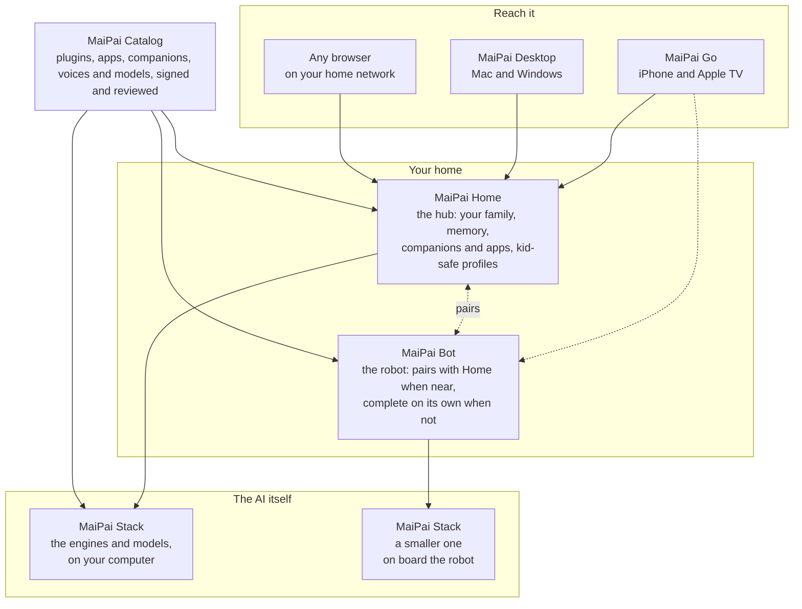

  <picture>
    <source media="(prefers-color-scheme: dark)" srcset="https://raw.githubusercontent.com/getmaipai/.github/main/brand/maipai-brand-logo-dark.png">
    
  </picture>

<i>say it like "my pie"</i>

<h3 align="center">Private, local AI that's actually yours.</h3>

<a href="https://getmaipai.github.io/"><b>getmaipai.github.io</b></a>

Your own AI at home, a robot companion, and apps to reach them anywhere, all on your own hardware, never the cloud.

---

<table>
  <tr>
    <td align="center" width="120">
      <picture>
        <source media="(prefers-color-scheme: dark)" srcset="https://raw.githubusercontent.com/getmaipai/.github/main/brand/maipai-home-icon-dark.png">
        
      </picture>
    </td>
    <td><b><a href="https://github.com/getmaipai/home">MaiPai Home</a></b> Your own AI, music, videos, podcasts, maps, books, and more, on your own hardware, online or offline - for protection, privacy, and independence.</td>
  </tr>
  <tr>
    <td align="center">
      <picture>
        <source media="(prefers-color-scheme: dark)" srcset="https://raw.githubusercontent.com/getmaipai/.github/main/brand/maipai-desktop-icon-dark.png">
        
      </picture>
    </td>
    <td><b>MaiPai Desktop</b> Mac and Windows app for your MaiPai Home and Bot, right on your desktop, integrated with your dock and your computer.</td>
  </tr>
  <tr>
    <td align="center">
      <picture>
        <source media="(prefers-color-scheme: dark)" srcset="https://raw.githubusercontent.com/getmaipai/.github/main/brand/maipai-go-icon-dark.png">
        
      </picture>
    </td>
    <td><b>MaiPai Go</b> iPhone and Apple TV app for your MaiPai Home and Bot: your own AI, media, and robot companion, wherever you are.</td>
  </tr>
  <tr>
    <td align="center">
      <picture>
        <source media="(prefers-color-scheme: dark)" srcset="https://raw.githubusercontent.com/getmaipai/.github/main/brand/maipai-bot-icon-dark.png">
        
      </picture>
    </td>
    <td><b>MaiPai Bot</b> A robot friend with its own onboard AI: it sees, hears, talks, thinks, moves, self-charges, and guards your home in sentry mode. It recognizes each person by face and voice, keeps its own memories of people, facts, and experiences, and learns and evolves with your family.</td>
  </tr>
</table>

<table>
  <tr>
    <td align="center" width="120">
      <picture>
        <source media="(prefers-color-scheme: dark)" srcset="https://raw.githubusercontent.com/getmaipai/.github/main/brand/maipai-stack-icon-dark.png">
        
      </picture>
    </td>
    <td><b><a href="https://github.com/getmaipai/stack">MaiPai Stack</a></b> The easy way to run your own local AI: the whole stack installed, watched, tested and kept up to date on your own computer, for you and anything you build on it.</td>
  </tr>
  <tr>
    <td align="center">
      
    </td>
    <td><b><a href="https://github.com/getmaipai/catalog">MaiPai Catalog</a></b> Every plugin, app, companion, integration, and model for your hub and robot, in one signed catalog you review and install with one click.</td>
  </tr>
</table>

## How it fits together

Six pieces, one house. Everything runs on your own hardware, and the
layers only talk to each other inside your home.

- **The Stack** runs the AI: it installs the engines and models, sizes
  them to your computer, and keeps them healthy. You can run it by
  itself.
- **Home** sits on top and adds the people: profiles, memory,
  companions, apps, and the rules for kids.
- **Bot** carries its own Stack and its own copy of Home's brain, so it
  works alone and joins the family when it is in range.
- **Go and Desktop** are how you reach Home and Bot from a phone, a TV
  or a computer. They never talk to the Stack directly.
- **The Catalog** is where everything installable comes from, reviewed
  and signed, added with one click.

Built and maintained by <a href="https://github.com/JesseWebDotCom">Jesse Torres</a>.

